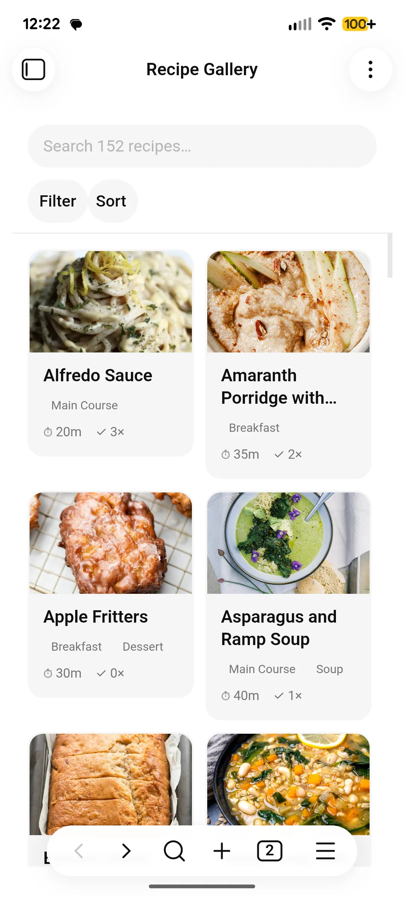
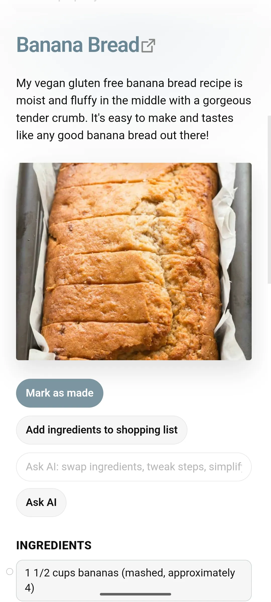
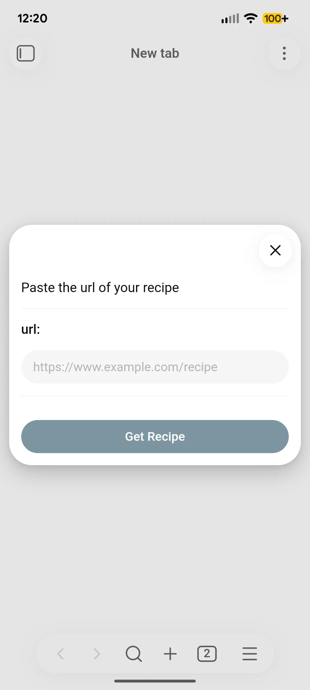
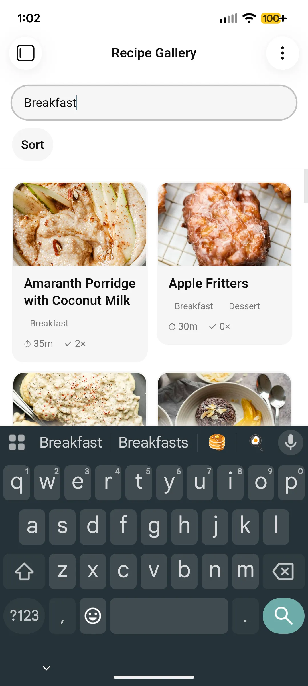

<div align="center">

# 🥘 Recipe Vault

**Your recipes, in plain markdown, right inside Obsidian.**

<a href="https://github.com/taylorsdugger/obsidian-recipe-vault/releases/latest"></a>

<a href="https://github.com/taylorsdugger/obsidian-recipe-vault/blob/main/LICENSE"></a>

<a href="https://www.buymeacoffee.com/taylorsdugger">
  
</a>

<br/>
<br/>
<br/>


&nbsp;&nbsp;


</div>

---

Import recipes from the web, browse them in a visual gallery, and build shopping lists automatically. Paste a URL, get a clean recipe note. No subscriptions, no accounts, no ads, just your recipes in your vault.

📦 **[Available in the Obsidian Community Plugins directory →](https://community.obsidian.md/plugins/recipe-vault)**

---

## ✨ Features

- 🌐 **Import from any URL:** fetches structured recipe data (JSON-LD) from a recipe page and creates a formatted note instantly.
- 📸 **Add recipe from photo:** photograph a cookbook page or recipe card (or pick image files) and let AI vision transcribe it into a recipe note, with a verify/edit step before saving. Works on desktop and mobile.
- ✍️ **Add recipes manually:** create a recipe note from scratch using the same template.
- 🖼️ **Recipe gallery:** browse your whole collection visually in a dedicated gallery view.
- 🔍 **Search everything:** filter as you type across titles, meal types, _and_ ingredients, so you can find every recipe that uses what's already in the fridge.
- ⚖️ **Shopping list:** check off ingredients in a note and send them to a single shopping list file, with automatic unit merging.
- 🔁 **Compare recipes:** select multiple recipes and view them side by side, with shared and unique ingredients highlighted.
- 📅 **Mark as made:** track when you last made a recipe and how many times.
- 🤖 **Ask AI for edits:** request changes like "make this dairy-free" or "scale to 2 servings" via OpenRouter (API key required).
- 🎨 **Customizable templates:** full Handlebars support so your notes look exactly how you want.

---

## 📥 Installation

### From the Obsidian Community Plugins browser

1. Open Obsidian → **Settings** → **Community plugins**
2. Search for **Recipe Vault**
3. Click **Install**, then **Enable**

### Manual installation

1. Download `main.js`, `manifest.json`, and `styles.css` from the [latest release](https://github.com/taylorsdugger/obsidian-recipe-vault/releases/latest).
2. Copy them into your vault at `.obsidian/plugins/recipe-vault/`.
3. Reload Obsidian and enable the plugin under **Settings → Community plugins**.

---

## 🚀 Quick Start

1. Click the **chef hat icon** in the ribbon (or run **Import recipe** from the command palette).
2. Paste a recipe URL and press Enter.
3. Your recipe note is created in the configured save folder.

To browse your recipes, click the **utensils icon** in the ribbon to open the Recipe Gallery.

<div align="center">


&nbsp;&nbsp;


</div>

---

## ⌨️ Commands

| Command                                      | What it does                                                                                             |
| -------------------------------------------- | -------------------------------------------------------------------------------------------------------- |
| **Import recipe**                            | Opens a URL prompt and imports a recipe into a new note                                                  |
| **Open recipe gallery**                      | Opens the visual gallery of your recipe notes                                                            |
| **Mark recipe as made**                      | Increments `times_made` and sets `last_made` to today on the active note                                 |
| **Add checked ingredients to shopping list** | Sends checked ingredients from the active recipe to your shopping list file                              |
| **Clear checked items from shopping list**   | Removes completed items from your shopping list                                                          |
| **Add recipe (manual)**                      | Creates a new recipe note from a title prompt                                                            |
| **Add recipe from photo**                    | Transcribes a photographed cookbook page or recipe card into a new note (requires an OpenRouter API key) |
| **Batch import recipes from URL list**       | Imports multiple recipes from a list of URLs (one per line) in the active note                           |
| **Rebuild ingredient search index**          | Rebuilds the in-memory index that powers ingredient search in the gallery                                |

---

## ⚙️ Settings

| Setting                                    | Description                                                                                                                                                                  |
| ------------------------------------------ | ---------------------------------------------------------------------------------------------------------------------------------------------------------------------------- |
| **Recipe save folder**                     | Where new recipe notes are created. The gallery browses this folder by default, so imports show up automatically                                                             |
| **Save in currently opened file**          | Import into the active note instead of creating a new one                                                                                                                    |
| **Save images**                            | Download recipe images into your vault                                                                                                                                       |
| **Save images in subdirectories**          | Create a per-recipe subfolder under the image folder                                                                                                                         |
| **Recipe template**                        | Handlebars template used when creating recipe notes                                                                                                                          |
| **Decode entities**                        | Decodes HTML entities in imported data                                                                                                                                       |
| **Proxy fallback for blocked imports**     | If a page blocks the import (e.g. a 403 from bot protection), retry once through a public read proxy (allorigins.win). Sends the recipe URL to a third party. Off by default |
| **Shopping list file**                     | Path to your shopping list note (created automatically if missing)                                                                                                           |
| **Recipe gallery folder**                  | The folder the Recipe Gallery browses, including its subfolders. **Leave blank to follow the Recipe save folder** (recommended). Set it only to browse a different folder    |
| **OpenRouter API key**                     | Required for Ask AI and Add recipe from photo                                                                                                                                |
| **AI model ID**                            | Which model to use for Ask AI and Add recipe from photo (default: `google/gemini-2.5-flash-lite`)                                                                            |
| **AI request timeout (ms)**                | Timeout for AI requests (minimum 5000 ms)                                                                                                                                    |
| **Custom AI system prompt**                | Optional override for the built-in Ask AI instructions                                                                                                                       |
| **Recipe title filler words**              | Controls how imported titles are cleaned up                                                                                                                                  |
| **Filter vegan words / gluten-free words** | Optionally strips dietary labels from imported recipe titles                                                                                                                 |
| **Debug mode**                             | Enables extra developer logging                                                                                                                                              |

> **Gallery is empty but you've imported recipes?** By default the gallery follows your **Recipe save folder**, so this shouldn't happen. If it does, you've set an explicit **Recipe gallery folder** that points somewhere other than where recipes are saved. Either clear that setting (blank = follow the save folder) or point it at your save folder, and your recipes will show up.

---

## 📝 Custom Templates

Recipe Vault uses [Handlebars](https://handlebarsjs.com/guide/#simple-expressions) for note templates. The plugin assumes the recipe page includes [JSON-LD structured data](https://developers.google.com/search/docs/appearance/structured-data/recipe).

### Built-in helpers

**`splitTags`** converts comma-separated tags into a YAML list for Obsidian frontmatter:

```handlebars
tags:
{{splitTags keywords}}
```

**`photoFrontmatter`** formats image values correctly for frontmatter (wikilink for local files, URL for remote):

```handlebars
photo: "{{photoFrontmatter image}}"
```

**`magicTime`** formats ISO durations and timestamps into readable values:

```handlebars
DateSaved:
{{magicTime}}
CookTime:
{{magicTime cookTime}}
TotalTime:
{{magicTime totalTime}}
DatePublished:
{{magicTime datePublished "dd-mm-yyyy"}}
```

Example output:

```
DateSaved: 2024-04-13 20:10
CookTime: 15m
TotalTime: 1h 5m
```

### Default frontmatter fields

```yaml
cssclasses: recipe-note
tags:
date_added:
meal_type:
author:
cook_time:
url:
photo:
times_made:
last_made:
```

> **Tip:** Keep frontmatter starting at line 1 of your template. Obsidian requires this to parse it correctly.

---

## 🤖 Ask AI

Recipe Vault can use an AI model to suggest edits to a recipe directly in the note preview (for example, "make this dairy-free" or "scale to 2 servings"). This requires an [OpenRouter](https://openrouter.ai/) API key, which you can add in plugin settings.

> **No OpenRouter key yet?** Sign up free at [openrouter.ai](https://openrouter.ai/), then grab a key from [openrouter.ai/keys](https://openrouter.ai/keys). It's pay-as-you-go (no subscription) — the default model costs well under a cent per request. Paste the key into **Recipe Vault settings → OpenRouter API key**.

The default model is `google/gemini-2.5-flash-lite`. Any OpenRouter-compatible model ID can be used, and you can optionally override the built-in system prompt in settings.

---

## 📸 Add Recipe from Photo

No cookbook page? No problem. Run **Add recipe from photo** from the command palette to turn a photographed cookbook page or recipe card into a note:

1. **Capture** — take a photo (camera opens automatically on mobile) or choose existing image files. Multiple photos are treated as pages of a single recipe, so multi-page cookbook spreads work in one go.
2. **Verify** — the vision model transcribes the name, ingredients, instructions, time, and yield; edit the result before saving to fix any misreads.
3. **Photo** — the captured photo is attached to the note by default, or choose a different image or none.

This uses the same [OpenRouter](https://openrouter.ai/) API key and model as Ask AI, so no separate setup is required. There's no bundled OCR engine — the vision model does the transcription — so it works on mobile too.

From my testing each receipe import from a cookbook costs under $0.001 on average (using Gemini 2.5 Flash Lite).

---

## 🔒 Network use and privacy

Recipe Vault is primarily local, but it can make network requests for the following features:

- **Recipe URL import:** fetches the page you provide to read recipe JSON-LD data. The URL and page response are used only to create recipe notes in your vault.
- **Proxy fallback (optional, off by default):** if an import is blocked and you enable this setting, the recipe URL is retried once through a public read proxy (allorigins.win), which sends that URL to a third-party service.
- **Recipe image download (optional):** when enabled, recipe images referenced by imported recipes are downloaded into your vault.
- **Ask AI via OpenRouter (optional):** sends your prompt plus recipe ingredients/instructions to OpenRouter to generate suggestions. Requests include your configured OpenRouter API key.
- **Add recipe from photo via OpenRouter (optional):** sends your captured/chosen photo(s) to OpenRouter for transcription. Requests include your configured OpenRouter API key.

No ads are shown, and no telemetry is collected by Recipe Vault itself.

---

## 🏷️ Releasing

Releases are automated via GitHub Actions.

1. Go to **Actions → Tag and Release**
2. Click **Run workflow** and choose `patch`, `minor`, or `major`
3. Review the draft release and publish when ready

---

## 🙏 Credits

Recipe Vault is based on [obsidian-recipe-grabber](https://github.com/seethroughdev/obsidian-recipe-grabber) by [@seethroughdev](https://github.com/seethroughdev), which provided the original URL import foundation. This project has since been substantially rewritten and extended with new features.

---

## 📄 License

[MIT](LICENSE)
