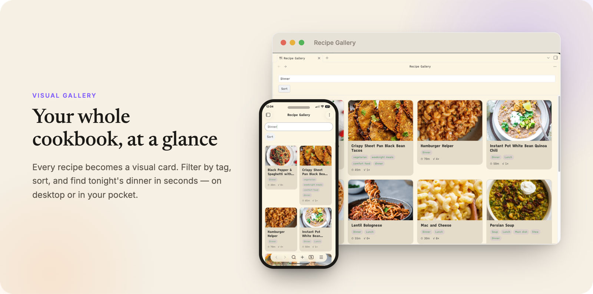
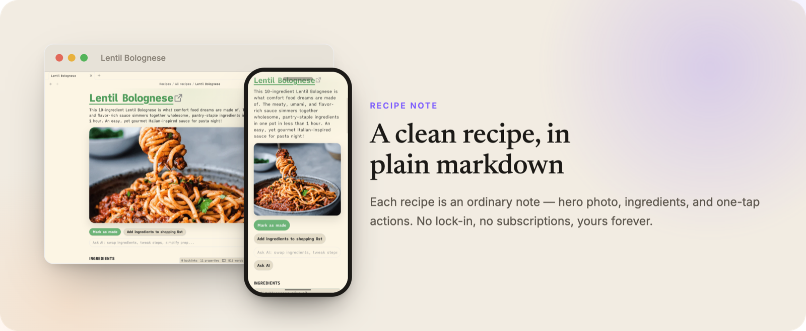
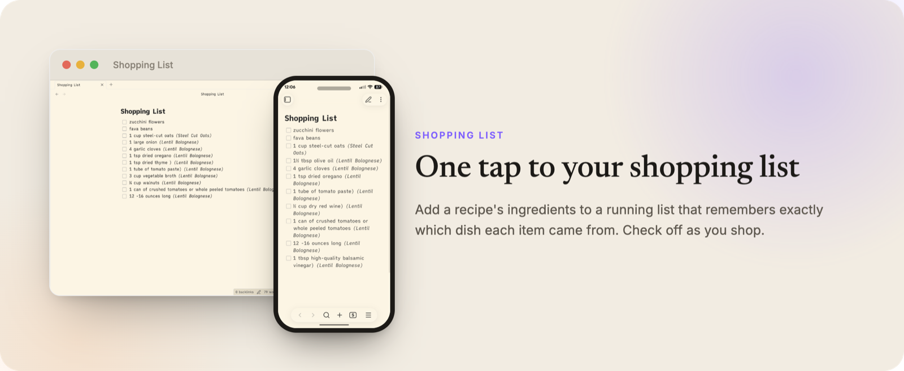
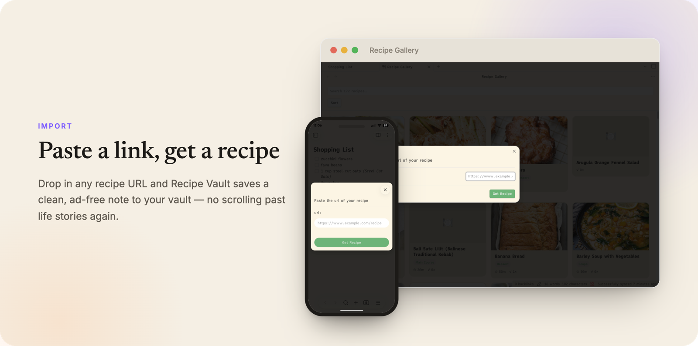
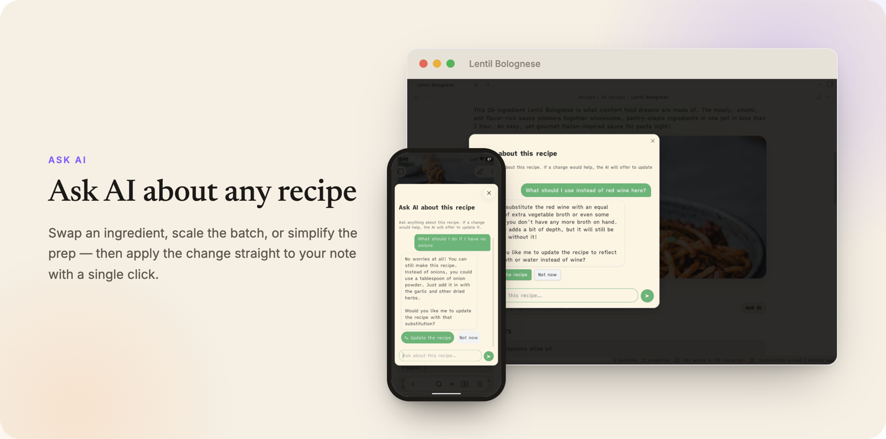

<div align="center">

# 🥘 Recipe Vault

**Your recipes, in plain markdown or Cooklang, right inside Obsidian.**

<a href="https://recipes.taylordugger.com"></a>
<a href="https://github.com/taylorsdugger/obsidian-recipe-vault/releases/latest"></a>

<a href="https://github.com/taylorsdugger/obsidian-recipe-vault/blob/main/LICENSE"></a>

<br/>

**[🌐 Visit the site](https://recipes.taylordugger.com)** &nbsp;·&nbsp; **[📦 Install from the community directory](https://community.obsidian.md/plugins/recipe-vault)**

<br/>



</div>

---

Import recipes from the web, browse them in a visual gallery, and build shopping lists automatically. Paste a URL, get a clean recipe note, or a [Cooklang](https://cooklang.org) file if you'd rather. No subscriptions, no accounts, no ads. Just your recipes in your vault.

Screenshots and a walkthrough of every feature: **[recipes.taylordugger.com](https://recipes.taylordugger.com)**.

---

## ✨ Features

- 🌐 **Import from any URL:** fetches structured recipe data (JSON-LD) from a recipe page and creates a formatted note instantly.
- 📸 **Add recipe from photo:** photograph a cookbook page or recipe card (or pick image files) and let AI vision transcribe it into a recipe note, with a verify/edit step before saving. Works on desktop and mobile.
- ✍️ **Add recipes manually:** create a recipe note from scratch using the same template.
- 🍳 **Cooklang support:** open `.cook` files in a recipe view, or have every new recipe saved as Cooklang instead of markdown. The gallery, search and shopping list work with both. See [Cooklang](#-cooklang).
- 📦 **Import and export files:** turn JSON-LD (`.json`) and Cooklang (`.cook`) files into recipes one at a time or a whole folder at once, and export any recipe back out as either.
- 🖼️ **Recipe gallery:** browse your whole collection visually in a dedicated gallery view, markdown notes and `.cook` files together.
- 🍽️ **Layouts that fit the screen:** on a wide pane the photo and ingredients sit in a column beside the steps. On a phone, the optional Kitchen layout splits a recipe into Ingredients and Steps tabs with a bar at the bottom. See [Reading a recipe](#-reading-a-recipe).
- 👩‍🍳 **Cook mode:** one step at a time in big type, with the ingredients that step uses and the next step in view. The screen stays on while it's open.
- 🔍 **Search everything:** filter as you type across titles, meal types, _and_ ingredients, so you can find every recipe that uses what's already in the fridge.
- ⚖️ **Shopping list:** tick ingredients in a recipe and send them to a single shopping list file. Duplicates combine even when the recipes wrote them differently - "1 large onion" and "2 yellow onions, diced" come out as one row of three - and the list is sorted by aisle, so the produce is together.
- 🔁 **Compare recipes:** select multiple recipes and view them side by side, with shared and unique ingredients highlighted.
- 📅 **Mark as made:** track when you last made a recipe and how many times.
- ➗ **Scale a recipe:** make a double batch, or six servings instead of four. The amounts change in the note, the `.cook` view, cook mode and the web app, and the shopping list gets the scaled amounts. See [Scaling a recipe](#scaling-a-recipe).
- 🤖 **Ask AI for edits:** chat about a recipe and ask for changes like "make this dairy-free" or "scale to 2 servings" via OpenRouter (API key required). You review the change before it's applied. Markdown notes only for now.
- 🎨 **Customizable templates:** full Handlebars support so your notes look exactly how you want.
- 🌗 **Fits your theme:** recipes take their colors, fonts and spacing from your Obsidian theme, light or dark.

<div align="center">



<br/>



</div>

---

## 📥 Installation

### From the Obsidian Community Plugins browser

1. Open Obsidian → **Settings** → **Community plugins**
2. Search for **Recipe Vault**
3. Click **Install**, then **Enable**

### Manual installation

1. Download `main.js`, `manifest.json`, and `styles.css` from the [latest release](https://github.com/taylorsdugger/obsidian-recipe-vault/releases/latest).
2. Copy them into your vault at `.obsidian/plugins/recipe-vault/`.
3. Reload Obsidian and enable the plugin under **Settings → Community plugins**.

---

## 🚀 Quick Start

1. Click the **chef hat icon** in the ribbon (or run **Import recipe** from the command palette).
2. Paste a recipe URL and press Enter.
3. Your recipe note is created in the configured save folder. If **Save new recipes as** is set to Cooklang, you get a `.cook` file instead.

To browse your recipes, click the **utensils icon** in the ribbon to open the Recipe Gallery. Open a recipe in reading view to cook from it.

<div align="center">



</div>

---

## ⌨️ Commands

| Command                                         | What it does                                                                                                     |
| ----------------------------------------------- | ---------------------------------------------------------------------------------------------------------------- |
| **Import recipe**                               | Opens a URL prompt and imports a recipe into a new note (or `.cook` file)                                        |
| **Open recipe gallery**                         | Opens the visual gallery of your recipes                                                                         |
| **Mark recipe as made**                         | Adds one to the times made and sets the last made date to today on the active recipe                             |
| **Start cook mode**                             | Opens the active recipe one step at a time. Works on notes and `.cook` files                                     |
| **Add checked ingredients to shopping list**    | Sends checked ingredients from the active recipe to your shopping list file                                      |
| **Clear checked items from shopping list**      | Removes completed items from your shopping list                                                                  |
| **Add recipe (manual)**                         | Creates a new recipe from a title prompt                                                                         |
| **Add recipe from photo**                       | Transcribes a photographed cookbook page or recipe card into a new recipe (requires an OpenRouter API key)       |
| **Batch import recipes from URL list**          | Imports multiple recipes from a list of URLs (one per line) in the active note                                   |
| **Import recipe from JSON-LD or Cooklang file** | Pick a `.json` or `.cook` file in your vault and make a recipe from it                                           |
| **Import recipes from folder**                  | Makes a recipe from every `.json` and `.cook` file in a folder. Also on a folder's right-click menu              |
| **Export recipe as JSON-LD file**               | Writes the active recipe out as a `.json` file next to it. Works on notes and `.cook` files                      |
| **Export recipe as Cooklang file**              | Writes the active recipe note out as a `.cook` file next to it                                                   |
| **Rebuild ingredient search index**             | Rebuilds the index that powers ingredient search in the gallery                                                  |
| **Fetch missing nutrition from source pages**   | Fills in nutrition, servings and serving size for recipes with a source link. Needs **Show nutrition** on        |

---

## ⚙️ Settings

| Setting                                    | Description                                                                                                                                                                  |
| ------------------------------------------ | ---------------------------------------------------------------------------------------------------------------------------------------------------------------------------- |
| **Recipe layout on small screens**         | **Classic** (default) is the recipe as one scrolling page. **Kitchen** splits it into Ingredients and Steps tabs with a bar at the bottom. Kitchen is used on phones and tablets, and on desktop when the recipe's pane is narrower than about 640px. See [Reading a recipe](#-reading-a-recipe) |
| **Show nutrition**                         | Calories, protein, carbs and fat per serving under At a Glance, nutrition on new imports, and the command that fetches it for older recipes. Off by default. See [Nutrition](#nutrition) |
| **Collapse properties on recipes**         | Folds a recipe's properties away when you open it, so the recipe comes first. Click **Properties** to open them. On by default                                              |
| **Recipe save folder**                     | Where new recipes are created. The gallery browses this folder by default, so imports show up automatically                                                                  |
| **Save new recipes as**                    | **Markdown note** (default) or **Cooklang file**. Applies to every import and to Add recipe (manual). Recipes you already have stay as they are                              |
| **Save in currently opened file**          | Import into the active note instead of creating a new one. Markdown only                                                                                                     |
| **Save images**                            | Download recipe images into your vault, into this folder. Leave the folder blank to use Obsidian's attachment location, or for a `.cook` file, to put the photo next to it   |
| **Save images in subdirectories**          | Create a per-recipe subfolder under the image folder                                                                                                                         |
| **Template file**                          | A note in your vault to use as the template instead of the one below. **Create** writes the current template out to a new note. Markdown only. See [Custom Templates](#-custom-templates) |
| **Recipe template**                        | Handlebars template used when creating recipe notes, when no template file is set. Markdown only                                                                             |
| **Photo property**                         | The frontmatter property that holds a recipe's photo (default `photo`). Set it to match your template, e.g. `image_url`, and the gallery reads that instead               |
| **Decode entities**                        | Decodes HTML entities in imported data                                                                                                                                       |
| **Proxy fallback for blocked imports**     | If a page blocks the import (e.g. a 403 from bot protection), retry once through a public read proxy (allorigins.win). Sends the recipe URL to a third party. Off by default |
| **Shopping list file**                     | Path to your shopping list note (created automatically if missing)                                                                                                           |
| **Recipe gallery folder**                  | The folder the Recipe Gallery browses, including its subfolders. **Leave blank to follow the Recipe save folder** (recommended). Set it only to browse a different folder    |
| **AI features**                            | On by default. Turn it off to hide the Ask AI button on recipe notes, the Add recipe from photo command, and the AI settings below                                              |
| **OpenRouter API key**                     | Required for Ask AI and Add recipe from photo                                                                                                                                |
| **AI model ID**                            | Which model to use for Ask AI and Add recipe from photo (default: `google/gemini-3.5-flash-lite`)                                                                            |
| **AI request timeout (ms)**                | Timeout for AI requests (minimum 5000 ms)                                                                                                                                    |
| **Custom AI system prompt**                | Optional override for the built-in Ask AI instructions                                                                                                                       |
| **Remove filler words from titles**        | Strips words like "easy" and "best" from imported titles, using the list for the recipe's language                                                                           |
| **Filler words to keep**                   | Built-in words you want left in titles                                                                                                                                       |
| **Extra filler words**                     | Your own words to strip from titles, in any language                                                                                                                         |
| **Filter vegan words / gluten-free words** | Optionally strips dietary labels from imported recipe titles                                                                                                                 |
| **Recipe language**                        | Which word lists to use when a recipe page doesn't say its language. Defaults to Obsidian's language                                                                         |
| **Debug mode**                             | Enables extra developer logging                                                                                                                                              |

> **Gallery is empty but you've imported recipes?** By default the gallery follows your **Recipe save folder**, so this shouldn't happen. If it does, you've set an explicit **Recipe gallery folder** that points somewhere other than where recipes are saved. Either clear that setting (blank = follow the save folder) or point it at your save folder, and your recipes will show up.

> **Title words in your language.** The built-in filler word lists cover English, German, Spanish and French for now. Each language is one JSON file in [`packages/core/src/parse/title-words`](packages/core/src/parse/title-words). Fixing a word or adding a language is a small pull request you can make from GitHub's web editor, and the [README there](packages/core/src/parse/title-words/README.md) walks through it.

---

## 🍲 Reading a recipe

The layouts below apply in reading view. Editing view stays plain markdown.

### On a wide pane

When the recipe's pane is at least 1000px wide, the photo and the ingredients sit in a column on the left that stays put as you scroll. The title, At a Glance, the buttons, the steps and the notes are on the right. The ingredients column shows how many you've ticked. Narrower than that, the recipe is one column, top to bottom.

The width is the pane's, not the window's, so a recipe in half of a split screen gets the single column.

### Ticking ingredients

A ticked ingredient means "add this to the list", so it's highlighted rather than crossed out. In the ingredients column and in the Kitchen layout you can tap anywhere on the row to tick it. **Add N to shopping list** sends the ticked ones to your shopping list and unticks them.

### Scaling a recipe

Above the ingredients there's a **−  Serves 4  +** control. If the note has `servings` in its frontmatter it moves a serving at a time. If not, it goes through ½×, 1×, 1½×, 2×, 3× and 4×. Tap the middle to go back to the recipe as written.

Only the amount at the front of each ingredient line changes, so "1 (14 oz) can tomatoes" doubled is "2 (14 oz) cans tomatoes". The steps are left alone. The note itself is never rewritten. The scale is kept per recipe until you close Obsidian, and **Add N to shopping list** and cook mode both use it.

New imports get `servings` from the recipe page when it has one. Older notes can have it added by hand.

### Nutrition

Nutrition is off until you turn on **Show nutrition** in settings. Until then nothing below shows up, imports don't add it, and the commands for it are hidden. Nutrition already in a note stays there either way.

With it on, if a recipe has nutrition, a line under At a Glance shows the calories and the protein, carbs and fat per serving. Click it for the details: the full breakdown, how the calories split between the three, and a **Whole recipe** switch that multiplies by the servings at the scale you're making it. On a phone it opens as a sheet from the bottom. The web app shows the same thing.

New imports get it from the recipe page when the page has it, which most food blogs do. It goes in the frontmatter as plain numbers, so you can sort and filter on it with Bases or Dataview, or type it in by hand:

```yaml
calories: 530
protein: 17
carbs: 58
fat: 26
fiber: 14
sugar: 10
sodium: 690
```

Calories are kcal, sodium is mg and the rest are grams. Any of them can be left out. A `.cook` file uses the same names in its front matter.

The numbers are per serving, and a serving is the recipe split by its `servings`. So with `servings: 4`, a serving is a quarter of it, and the details say so. When the page gives a real serving size, like "1 of 12 fritters", that goes in as `serving_size` and shows instead. The "1 serving" most food blogs put there is kept but not shown, since it doesn't say anything. A `.cook` file calls it `serving size`.

For recipes imported before this, run **Fetch missing nutrition from source pages** from the command palette. It finds every recipe in the gallery folder that has a source link and is missing its nutrition, its `servings` or its serving size, loads each page one at a time, and adds what it finds. It only adds. Anything already in the note stays. **Stop fetching nutrition** stops it partway.

### Buttons

Under At a Glance:

- **Mark as made** adds one to times made and stamps today as the last made date.
- **Add N to shopping list** sends what's ticked.
- **Ask AI** opens a chat about the recipe. See [Ask AI](#-ask-ai).
- **Cook** opens cook mode.

### Kitchen layout

Set **Recipe layout on small screens** to **Kitchen** for a layout built for cooking from a phone:

- An **Ingredients / Steps** switch at the top shows one half of the recipe at a time. Each half remembers where you were scrolled.
- A **Cook** button next to the switch opens cook mode.
- Bigger ingredient rows, and a bar at the bottom with **Mark as made**, **Ask AI** and **Add N to list**.

Kitchen is used on phones and tablets, and on desktop when the recipe's pane is narrower than about 640px. Everywhere else you get the wide or single column layout above. **Classic**, the default, keeps the single scrolling page on a phone.

### Cook mode

Click **Cook**, or run **Start cook mode**, to go through the steps one at a time:

- The current step in large type, with its sub-section name if the instructions have `####` headings.
- **For this step:** the ingredients the step mentions, matched by name with the amounts left off.
- A card above the buttons with the next step, so you know what's coming.
- **Back** and **Next step** buttons. On a keyboard, ← and → move between steps and Esc closes.
- The list icon at the top shows the full ingredient list.
- The screen stays on while cook mode is open, on devices that allow it. "Screen stays on" only shows when it really will.

On the last step, **Done** closes cook mode and asks whether to mark the recipe as made. On a phone, cook mode fills the screen.

### Styling it yourself

Recipes take every color, font, radius and spacing from your theme, so they should look at home in any theme, light or dark. To change the layout itself, override these properties on `.recipe-note` in a CSS snippet:

| Property                      | What it sets                                         |
| ----------------------------- | ---------------------------------------------------- |
| `--recipe-rail-width`         | Width of the ingredients column on a wide pane       |
| `--recipe-gap`                | Space between the ingredients column and the steps   |
| `--recipe-hero-radius`        | Corner radius of the photo                           |
| `--recipe-radius`             | Corner radius of the ingredient list                 |
| `--recipe-border`             | Lines around and between ingredient rows             |
| `--recipe-surface`            | Background of the Ingredients / Steps switch         |
| `--recipe-row-min-height`     | Height of a Kitchen ingredient row                   |
| `--recipe-picked-bg`          | Background of a ticked ingredient                    |
| `--recipe-picked-decoration`  | Set to `line-through` if you'd rather cross them out |
| `--recipe-meta-callout-color` | The At a Glance callout's color, as an RGB triplet   |
| `--recipe-dock-bg`            | Background of the Kitchen bar at the bottom          |

For example, a wider ingredients column:

```css
.recipe-note {
  --recipe-rail-width: 26rem;
}
```

---

## 📝 Custom Templates

Recipe Vault uses [Handlebars](https://handlebarsjs.com/guide/#simple-expressions) for note templates. The plugin assumes the recipe page includes [JSON-LD structured data](https://developers.google.com/search/docs/appearance/structured-data/recipe).

### Template file

You can edit the template in settings, or keep it as a note in your vault and point **Template file** at it. A file is easier to edit, it syncs with the rest of your vault, and the plugin never overwrites it.

To start one, click **Create** next to **Template file**. That writes your current template to `Recipe Vault template.md` in the vault root and selects it. You can move or rename it after, just update the setting. If the file goes missing, new recipes use the template in settings and you get a notice.

Some things to know:

- Keep it outside your recipe folder. The plugin skips the template file itself, but other plugins that list your recipes won't know to.
- Obsidian may flag the `{{...}}` values in the template's own properties as invalid. That only affects the template note, not the recipes made from it.
- If your template keeps the photo under a different property, like `image_url`, set **Photo property** to match. Otherwise the plugin adds a `photo` property to every new note so the gallery can find the image.

### Built-in helpers

**`splitTags`** converts comma-separated tags into a YAML list for Obsidian frontmatter:

```handlebars
tags:
{{splitTags keywords}}
```

**`photoFrontmatter`** formats image values correctly for frontmatter (wikilink for local files, URL for remote):

```handlebars
photo: "{{photoFrontmatter image}}"
```

**`magicTime`** formats ISO durations and timestamps into readable values:

```handlebars
DateSaved:
{{magicTime}}
CookTime:
{{magicTime cookTime}}
TotalTime:
{{magicTime totalTime}}
DatePublished:
{{magicTime datePublished "dd-mm-yyyy"}}
```

Example output:

```
DateSaved: 2024-04-13 20:10
CookTime: 15m
TotalTime: 1h 5m
```

### Default frontmatter fields

```yaml
cssclasses: recipe-note
tags:
date_added:
meal_type:
author:
cook_time:
servings:
url:
photo:
times_made:
last_made:
```

If your template leaves out `cssclasses`, `cook_time` or the photo property, the plugin adds them to new notes. The gallery needs them. Your template itself is never changed.

> **Tip:** Keep frontmatter starting at line 1 of your template. Obsidian requires this to parse it correctly.

---

## 🍳 Cooklang

[Cooklang](https://cooklang.org) is a plain-text recipe format. Instead of a separate ingredient list, ingredients are marked right in the steps:

```
---
title: Leek Soup
servings: 4
time: 45m
---

Melt @butter{2%tbsp} in a #large pot{} and soften @leeks{3}(sliced) for ~{10%minutes}.

Add @stock{1%l} and simmer for ~{20%minutes}.
```

### Opening .cook files

Recipe Vault opens `.cook` files in their own view, laid out like a recipe note: an "At a Glance" box, the ingredients as a checkbox list, cookware, and the steps with ingredients, cookware and timers picked out. Your theme styles it the same as your notes, and it uses the same layouts: the ingredients column on a wide pane, and the Kitchen layout on a small screen if you've turned it on. See [Reading a recipe](#-reading-a-recipe).

- **Mark as made** and **Add N to shopping list** work from the view, the same as from a note. Times made is saved in the file as `times made` and `last made`.
- The scale control works the same as in a note, going by `servings`. Every `@ingredient{}` amount scales, in the list and in the steps. An amount fixed with `=`, like `@salt{=1%pinch}`, stays put, and so do timers.
- **Cook** opens cook mode. A `.cook` file says exactly which ingredients each step uses, so **For this step** is always right.
- **Edit** switches to a plain text editor over the file. The pencil in the view's header does the same.
- The photo at the top is the one named after the recipe and sitting next to it (`Leek Soup.jpg` beside `Leek Soup.cook`), which is where Cooklang keeps photos. Failing that, it's whatever the file's `image:` points at, a path in your vault or a URL.
- Another recipe used as an ingredient, like `@./Sauces/Hollandaise{150%g}`, is a link you can click. It's looked for next to the file, then in your recipe folder, then anywhere in the vault by name.
- Ticked ingredients reset when you close the file, since a `.cook` file has nowhere to keep them.

If you also have the Cooklang plugin installed, whichever plugin loads first opens `.cook` files. Recipe Vault leaves them alone if another plugin already has them.

### Saving new recipes as Cooklang

Set **Save new recipes as** to **Cooklang file** and every new recipe is saved as a `.cook` file: URL imports, batch imports, photo imports, file and folder imports, and Add recipe (manual). Switch it back to Markdown and new recipes are notes again. Nothing you already have gets converted either way, and the gallery shows both.

Recipe pages keep the ingredients apart from the steps, and Cooklang marks them inside the steps, so an import has to match them up. Each ingredient is marked in the first step that mentions it. "1 yellow onion, diced" matches a step that says "the onions" and becomes `@yellow onion{1}(diced)`. An ingredient no step mentions goes in a "Gather" step at the top so nothing is lost.

The photo goes in your image folder (see **Save images**) and the file's `image:` points at it. If the image folder is blank, it goes next to the file as `Recipe Name.jpg` instead.

Importing a `.cook` file while in Cooklang mode copies it as written, so its cookware and timers come along.

### The gallery

`.cook` files show up in the gallery next to your notes, with their photo, meal type (`course`), cook time (`time`) and times made, and their ingredients are searchable. When a `.cook` file sits next to a note with the same name, which is what **Export recipe as Cooklang file** leaves behind, only the note shows.

---

## 📦 Importing and exporting files

Recipe Vault can turn recipe files already in your vault into recipes:

- **JSON-LD (`.json`):** a schema.org Recipe, the same data recipe websites carry. One file can hold several recipes.
- **Cooklang (`.cook`):** see [Cooklang](#-cooklang).

Right-click a file and choose **Import as recipe**, or run **Import recipe from JSON-LD or Cooklang file**. Obsidian only shows `.json` files in the file explorer with **Files and links → Detect all file extensions** turned on.

To import a whole folder, right-click it and choose **Import recipes from folder**. Subfolders are kept, so `Imports/Desserts/pie.json` lands in `Recipes/Desserts/`. It's safe to run again: a recipe whose URL or source file is already in your vault is skipped. Files that can't be read are listed in an `Import errors` note in the folder you imported. A folder with 1,000 or more files asks first, since the gallery gets slow with thousands of recipes.

To go the other way, right-click a recipe and choose **Export recipe as JSON-LD** or **Export recipe as Cooklang**, or use the matching commands. The file is written next to the recipe. A `.cook` file can be exported as JSON-LD too. Times made comes along, so exporting and importing a recipe back doesn't reset it.

---

## 🤖 Ask AI

Click **Ask AI** on a markdown recipe note to chat about it. Ask a question ("what can I use instead of fish sauce?") or ask for a change ("make this dairy-free", "scale to 2 servings"). When a reply suggests a change, an **Update the recipe** button appears under it. That shows what would change in the ingredients and steps, and nothing changes in your note until you apply it.

This requires an [OpenRouter](https://openrouter.ai/) API key, which you can add in plugin settings.

<div align="center">



</div>

> **No OpenRouter key yet?** Sign up free at [openrouter.ai](https://openrouter.ai/), then grab a key from [openrouter.ai/keys](https://openrouter.ai/keys). It's pay-as-you-go (no subscription), and the default model costs well under a cent per request. Paste the key into **Recipe Vault settings → OpenRouter API key**.

The default model is `google/gemini-3.5-flash-lite`. Any OpenRouter-compatible model ID can be used, and you can optionally override the built-in system prompt in settings.

Don't want any of this? Turn off **AI features** in settings. That hides the Ask AI button, the Add recipe from photo command, and the AI settings.

---

## 📸 Add Recipe from Photo

No cookbook page? No problem. Run **Add recipe from photo** from the command palette to turn a photographed cookbook page or recipe card into a note:

1. **Capture:** take a photo (camera opens automatically on mobile) or choose existing image files. Multiple photos are treated as pages of a single recipe, so multi-page cookbook spreads work in one go.
2. **Verify:** the vision model transcribes the name, ingredients, instructions, time, and yield; edit the result before saving to fix any misreads.
3. **Photo:** the captured photo is attached to the recipe by default, or choose a different image or none.

This uses the same [OpenRouter](https://openrouter.ai/) API key and model as Ask AI, so no separate setup is required. There's no bundled OCR engine; the vision model does the transcription, so it works on mobile too.

From my testing each recipe import from a cookbook costs under $0.001 on average (using Gemini 2.5 Flash Lite).

---

## 🔒 Network use and privacy

Recipe Vault is primarily local, but it can make network requests for the following features:

- **Recipe URL import:** fetches the page you provide to read recipe JSON-LD data. The URL and page response are used only to create recipe notes in your vault.
- **Proxy fallback (optional, off by default):** if an import is blocked and you enable this setting, the recipe URL is retried once through a public read proxy (allorigins.win), which sends that URL to a third-party service.
- **Recipe image download (optional):** when enabled, recipe images referenced by imported recipes are downloaded into your vault. This includes the image URL in an imported JSON-LD file.
- **Ask AI via OpenRouter (optional):** sends your prompt plus recipe ingredients/instructions to OpenRouter to generate suggestions. Requests include your configured OpenRouter API key.
- **Add recipe from photo via OpenRouter (optional):** sends your captured/chosen photo(s) to OpenRouter for transcription. Requests include your configured OpenRouter API key.

No ads are shown, and no telemetry is collected by Recipe Vault itself.

---

## 🏷️ Releasing

Releases are automated via GitHub Actions.

1. Go to **Actions → Tag and Release**
2. Click **Run workflow** and choose `patch`, `minor`, or `major`
3. Review the draft release and publish when ready

---

## 🙏 Credits

Recipe Vault is based on [obsidian-recipe-grabber](https://github.com/seethroughdev/obsidian-recipe-grabber) by [@seethroughdev](https://github.com/seethroughdev), which provided the original URL import foundation. This project has since been substantially rewritten and extended with new features.

---

## 📄 License

[MIT](LICENSE)
